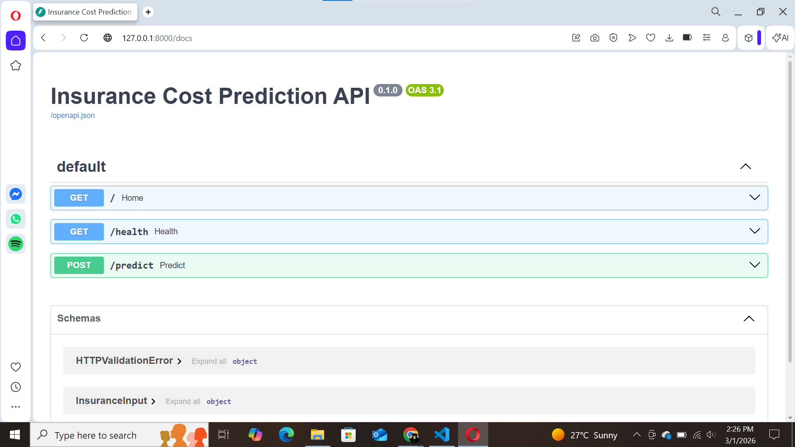

# Insurance Cost Prediction API (Regression)

This project predicts medical insurance charges using a Machine Learning regression model and serves predictions through a FastAPI endpoint.

---

## Tech Stack
- Python
- Pandas
- Scikit-learn
- RandomForestRegressor
- FastAPI
- Joblib

---

## Setup

```bash
python -m venv .venv
.venv\Scripts\activate
pip install -r requirements.txt
```

---

## Train Model

```bash
python -m src.train
```

---

## Run API

```bash
uvicorn src.app:app --reload
```

Open Swagger UI:
http://127.0.0.1:8000/docs

---

## Screenshots

### API Running


### Swagger Docs


### Request Body


### Prediction Response
