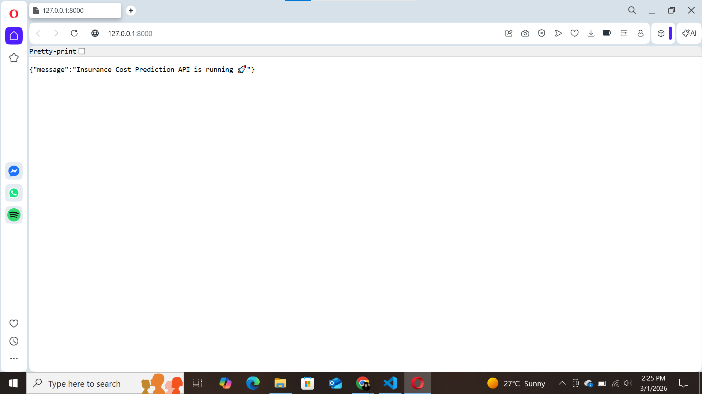
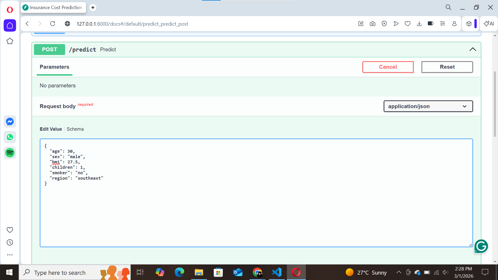
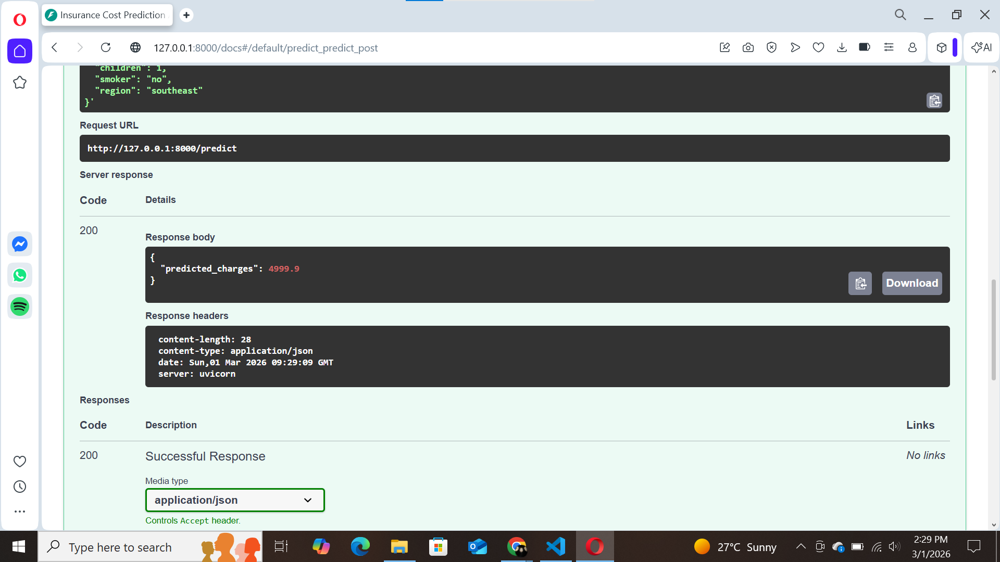

# Insurance Cost Prediction API (Regression)

This project predicts medical insurance charges using a Machine Learning regression model and serves predictions through a FastAPI endpoint.

## Features
- Regression model: RandomForestRegressor
- Preprocessing: OneHotEncoding for categorical features
- REST API: FastAPI + Swagger UI
- Model saved offline using joblib

## Tech Stack
- Python
- Pandas
- Scikit-learn
- FastAPI + Uvicorn
- Joblib

## Project Structure
- `src/train.py` → trains the model and saves it to `models/model.joblib`
- `src/app.py` → FastAPI app with `/predict` endpoint
- `src/schemas.py` → input validation using Pydantic

## Setup
```bash
python -m venv .venv
.venv\Scripts\activate
pip install -r requirements.txt

## Screenshots

### Api Running


### Swagger Documentation


### Request Body (Try it out)


### Prediction Response
